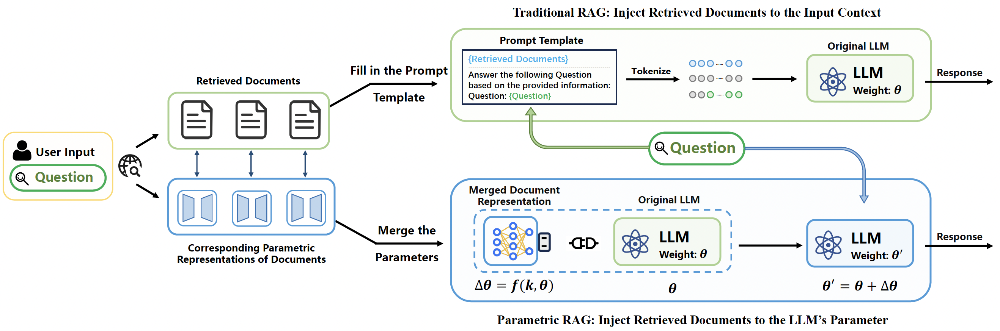
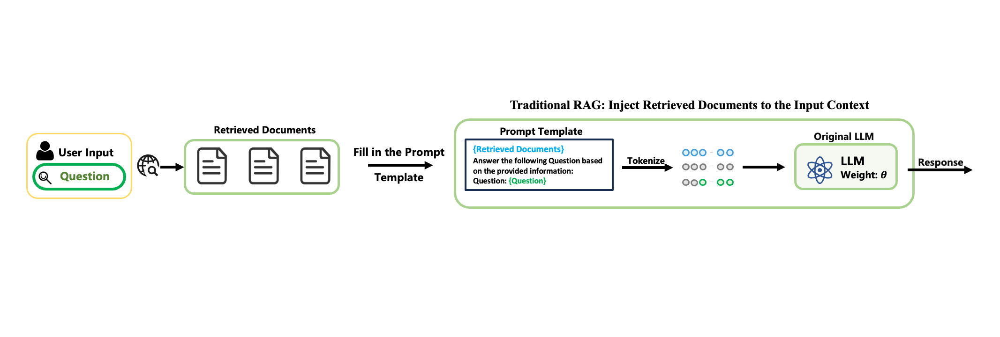

# Parametric RAG

This repository contains the official implementation of **Parametric Retrieval-Augmented Generation (Parametric RAG / PRAG)**.

**News:** this work has been accepted at SIGIR 2025.





## Overview

Parametric RAG is a retrieval-augmented generation pipeline that converts retrieved documents into **document-level LoRA adapters**. At inference time, the system retrieves the relevant documents, loads the corresponding adapters, merges them, and generates an answer with the merged parametric knowledge.

The repository is organized around the following experiment flow:

```text
Raw QA data + Wikipedia BM25 index
    -> src/augment.py
    -> data_aug/
    -> src/encode.py
    -> offline/
    -> src/inference.py
    -> output/
```

The three main stages are:

| Stage | Script | Output | Purpose |
| --- | --- | --- | --- |
| Self-Augmentation | `src/augment.py` | `data_aug/` | Retrieve top-k passages, rewrite passages, and generate synthetic QA for each passage |
| Document Parameterizing | `src/encode.py` | `offline/` | Train one LoRA adapter per retrieved passage |
| Inference | `src/inference.py` | `output/` | Merge passage adapters and evaluate generated answers |

## Repository Layout

```text
PRAG/
├── README.md
├── project_description.md
├── all_prompt.md
├── pyproject.toml
├── requirements.txt
├── data_aug.tar.gz
├── assets/
├── configs/
├── result_tables/
├── case_study/
├── script/
├── src/
│   ├── augment.py
│   ├── encode.py
│   ├── inference.py
│   ├── export_predict_with_passages.py
│   ├── get_warmup_data.py
│   ├── warmup_lora.py
│   ├── prompt_template.py
│   ├── utils.py
│   ├── root_dir_path.py
│   ├── fewshot/
│   └── retrieve/
└── prep_elastic.py
```

Generated or local experiment directories are ignored by git:

| Path | Role |
| --- | --- |
| `data/` | Raw benchmark data, DPR Wikipedia passages, and Elasticsearch files |
| `data_aug/` | Augmented retrieval and synthetic QA files |
| `offline/` | Trained document-level LoRA adapters |
| `output/` | Prediction files, evaluation results, and configs |
| `logs/` | Batch job logs |

`project_description.md` contains a Korean codebase walkthrough. `all_prompt.md` contains the prompts used by the experiments.

## Supported Settings

Supported model shortcuts are defined in `src/utils.py`:

| Shortcut | Hugging Face model |
| --- | --- |
| `llama3.2-1b-instruct` | `meta-llama/Llama-3.2-1B-Instruct` |
| `llama3-8b-instruct` | `meta-llama/Meta-Llama-3-8B-Instruct` |
| `qwen2.5-1.5b-instruct` | `Qwen/Qwen2.5-1.5B-Instruct` |

Supported built-in datasets:

| Dataset | Common data types |
| --- | --- |
| `2wikimultihopqa` | `inference`, `comparison`, `bridge_comparison`, `compositional`, `total` |
| `hotpotqa` | `bridge`, `comparison`, `total` |
| `complexwebquestions` | `total` |
| `popqa` | `total` |

Inference modes:

| Mode | Meaning |
| --- | --- |
| `vanilla` | Generate from the base model without retrieved passages or LoRA |
| `icl` | Standard in-context RAG using retrieved passages in the prompt |
| `prag` | Parametric RAG using merged LoRA adapters only |
| `combine` | Use both retrieved passages and merged LoRA adapters |

## Environment Setup

The project targets Python `3.10.4`.

```bash
conda create -n prag python=3.10.4
conda activate prag
pip install -r requirements.txt
```

Or, if you use `uv`:

```bash
uv sync
source .venv/bin/activate
```

The dependency files currently pin:

- `torch==1.13.1`
- `transformers==4.44.2`
- `peft==0.13.2`
- `elasticsearch==8.15.0`
- `faiss-cpu==1.8.0`

If you need a CUDA-specific PyTorch wheel, install the correct `torch` build for your machine before or after installing the other requirements.

Meta Llama models are gated on Hugging Face. Log in before running code that loads Llama models:

```bash
huggingface-cli login
```

## Required Local Path

The code uses a hardcoded project root in `src/root_dir_path.py`.

```python
ROOT_DIR = "/mnt/raid5/choihb/PRAG"
```

After moving or cloning the repository to another path, update this value first. Many scripts build paths for `data_aug/`, `offline/`, `output/`, and `warmup/` from `ROOT_DIR`.

## Quick Start With Existing Augmented Data

The repository includes `data_aug.tar.gz`. Extract it if `data_aug/` is missing:

```bash
tar -xzvf data_aug.tar.gz
```

If matching LoRA adapters already exist under `offline/`, run inference directly:

```bash
python src/inference.py \
    --model_name llama3.2-1b-instruct \
    --dataset 2wikimultihopqa \
    --data_type comparison \
    --sample 300 \
    --num_train_epochs 1 \
    --learning_rate 0.0003 \
    --lora_rank 2 \
    --lora_alpha 32 \
    --max_new_tokens 128 \
    --inference_method combine \
    --with_cot
```

Results are written to:

```text
output/{model_name}/rank={lora_rank}_alpha={lora_alpha}/{dataset}/
  lr={learning_rate}_epoch={num_train_epochs}_{direct|cot}/
  aug_model={augment_model}/{inference_method}/{data_type}/
    config.json
    predict.json
    predict_with_passages.json
    result.txt
```

If `offline/` does not contain the matching adapters, run `src/encode.py` first.

```bash
python src/encode.py \
    --model_name llama3.2-1b-instruct \
    --dataset 2wikimultihopqa \
    --data_type comparison \
    --sample 300 \
    --per_device_train_batch_size 1 \
    --num_train_epochs 1 \
    --learning_rate 0.0003 \
    --lora_rank 2 \
    --lora_alpha 32 \
    --with_cot
```

LoRA adapters are written to:

```text
offline/{model_name}/rank={lora_rank}_alpha={lora_alpha}/{dataset}/
  lr={learning_rate}_epoch={num_train_epochs}_{direct|cot}/
  aug_model={augment_model}/{data_type}/data_{did}/passage_{pid}/
```

## Reproduce Configured Experiments

The `configs/` directory contains the main encode + inference commands used for the current experiment setup.

Examples:

```bash
bash configs/2wikimultihopqa_llama3.2-1b-instruct.sh
bash configs/hotpotqa_llama3-8b-instruct.sh
bash configs/popqa_qwen2.5-1.5b-instruct.sh
```

These configs use the following default LoRA settings unless noted otherwise:

```text
lora_rank = 2
lora_alpha = 32
learning_rate = 0.0003
sample = 300
```

`2wikimultihopqa` and `hotpotqa` configs use `--with_cot`; `popqa` and `complexwebquestions` use direct answering.

Batch scripts in `script/` are tailored to the local cluster environment, including node names, project paths, and GPU assumptions. Check and edit those values before submitting them with SLURM.

## Prepare BM25 Retrieval

`src/augment.py` needs a BM25 index over DPR Wikipedia passages.

Download the DPR Wikipedia passage dump:

```bash
mkdir -p data/dpr
wget -O data/dpr/psgs_w100.tsv.gz \
  https://dl.fbaipublicfiles.com/dpr/wikipedia_split/psgs_w100.tsv.gz
gzip -d data/dpr/psgs_w100.tsv.gz
```

Download and start Elasticsearch 8.15.0:

```bash
mkdir -p data
wget -O data/elasticsearch-8.15.0.tar.gz \
  https://artifacts.elastic.co/downloads/elasticsearch/elasticsearch-8.15.0-linux-x86_64.tar.gz
tar -xzf data/elasticsearch-8.15.0.tar.gz -C data
rm data/elasticsearch-8.15.0.tar.gz

ES_JAVA_OPTS="-Xms8g -Xmx8g" \
data/elasticsearch-8.15.0/bin/elasticsearch \
  -E discovery.type=single-node \
  -E xpack.security.enabled=false \
  -E xpack.security.http.ssl.enabled=false \
  -E network.host=127.0.0.1 \
  -E http.port=9200
```

In another shell, build the `wiki` index:

```bash
export ELASTICSEARCH_URL=http://localhost:9200
python prep_elastic.py \
    --data_path data/dpr/psgs_w100.tsv \
    --index_name wiki \
    --es_host "$ELASTICSEARCH_URL"
```

`src/retrieve/retriever.py` reads `ES_HOST` or `ELASTICSEARCH_URL` and defaults to `http://localhost:9200`.

## Prepare Raw Datasets

Use the following paths for the built-in dataset loaders:

```text
data/2wikimultihopqa/dev.json
data/2wikimultihopqa/id_aliases.json
data/hotpotqa/hotpot_dev_distractor_v1.json
data/popqa/popQA.tsv
data/complexwebquestions/ComplexWebQuestions_dev.json
```

Download sources:

- 2WikiMultihopQA: download `data_ids_april7.zip` from the official repository and place the extracted files in `data/2wikimultihopqa/`.
- HotpotQA:

```bash
mkdir -p data/hotpotqa
wget -P data/hotpotqa \
  http://curtis.ml.cmu.edu/datasets/hotpot/hotpot_dev_distractor_v1.json
```

- PopQA:

```bash
mkdir -p data/popqa
wget -O data/popqa/popQA.tsv \
  https://raw.githubusercontent.com/AlexTMallen/adaptive-retrieval/main/data/popQA.tsv
```

- ComplexWebQuestions: download `ComplexWebQuestions_dev.json` from the official dataset page and place it in `data/complexwebquestions/`.

## Run Self-Augmentation

After the raw data and BM25 index are ready:

```bash
python src/augment.py \
    --model_name llama3.2-1b-instruct \
    --dataset 2wikimultihopqa \
    --data_path data/2wikimultihopqa \
    --sample 300 \
    --topk 3
```

Arguments:

| Argument | Description |
| --- | --- |
| `--model_name` | Model used to rewrite passages and generate synthetic QA |
| `--dataset` | Built-in dataset name or custom dataset name |
| `--data_path` | Raw dataset folder, or JSON file for custom default-format data |
| `--sample` | Number of examples to process |
| `--topk` | Number of valid passages to keep per question |

Output:

```text
data_aug/{dataset}/{model_name}/{data_type}.json
```

For custom data, pass a JSON file containing:

```json
[
  {
    "question": "string",
    "answer": "string or list[string]"
  }
]
```

The JSON file name becomes the `data_type`.

## Run Document Parameterizing

`src/encode.py` trains passage-level LoRA adapters from `data_aug/`.

```bash
python src/encode.py \
    --model_name llama3.2-1b-instruct \
    --dataset 2wikimultihopqa \
    --data_type comparison \
    --sample 300 \
    --per_device_train_batch_size 1 \
    --num_train_epochs 1 \
    --learning_rate 0.0003 \
    --lora_rank 2 \
    --lora_alpha 32 \
    --with_cot
```

Important behavior:

- If `--augment_model` is omitted, it defaults to `--model_name`.
- The first run for a LoRA rank/alpha pair creates `offline/{model}/rank={rank}_alpha={alpha}/base_weight/`.
- Existing passage adapters are skipped, so interrupted runs can usually be resumed.
- LoRA target modules are `down_proj`, `gate_proj`, and `up_proj`.

For `llama3-8b-instruct` single-GPU encoding, the code supports:

```bash
export PRAG_LLAMA8B_ENCODE_MODE=single_gpu
```

## Run Inference And Evaluation

```bash
python src/inference.py \
    --model_name llama3.2-1b-instruct \
    --dataset 2wikimultihopqa \
    --data_type comparison \
    --sample 300 \
    --num_train_epochs 1 \
    --learning_rate 0.0003 \
    --lora_rank 2 \
    --lora_alpha 32 \
    --max_new_tokens 128 \
    --inference_method combine \
    --with_cot
```

For short-answer datasets such as PopQA and ComplexWebQuestions, configs use `--max_new_tokens 20`. For multi-hop CoT datasets, configs use `--max_new_tokens 128`.

The script writes:

| File | Description |
| --- | --- |
| `config.json` | Full run arguments |
| `predict.json` | Raw predictions and per-example EM/F1/precision/recall |
| `predict_with_passages.json` | Predictions joined with retrieved passages |
| `result.txt` | Aggregate EM/F1/precision/recall |

`predict.json` is read on startup, so interrupted inference runs continue from the completed prefix.

## Export Predictions With Passages

`src/inference.py` automatically creates `predict_with_passages.json`. To regenerate it later:

```bash
python src/export_predict_with_passages.py --all
```

Or for specific prediction files:

```bash
python src/export_predict_with_passages.py \
    --predict-file output/.../predict.json
```

## Results And Case Study

Current summarized experiment metrics are stored in:

```text
result_tables/eval_metrics_all_models_all_modes.md
result_tables/eval_metrics_all_models_all_modes.tsv
```

The case study file is:

```text
case_study/case.json
```

## Warm-Up LoRA

Warm-up training data can be generated from held-out later portions of the datasets:

```bash
python src/get_warmup_data.py
```

Then train warm-up LoRA weights:

```bash
python src/warmup_lora.py \
    --model_name llama3.2-1b-instruct \
    --per_device_train_batch_size 1 \
    --num_train_epochs 1 \
    --learning_rate 3e-4 \
    --block_size 3000 \
    --lora_rank 2 \
    --lora_alpha 32 \
    --with_cot
```

Without `--with_cot`, the direct-answer warm-up path is used.

## Troubleshooting

- If paths are wrong, check `src/root_dir_path.py` first.
- If retrieval fails, confirm Elasticsearch is reachable at `ELASTICSEARCH_URL` or `ES_HOST` and that the `wiki` index exists.
- If Llama loading fails, confirm Hugging Face access and `huggingface-cli login`.
- If `src/inference.py` cannot find adapters, verify that `--model_name`, `--dataset`, `--data_type`, `--augment_model`, `--num_train_epochs`, `--learning_rate`, `--lora_rank`, `--lora_alpha`, and `--with_cot` match the earlier `src/encode.py` run.
- If CUDA memory is tight, reduce sample size, encode fewer data types at a time, or use the single-GPU mode for Llama 3 8B encoding.
